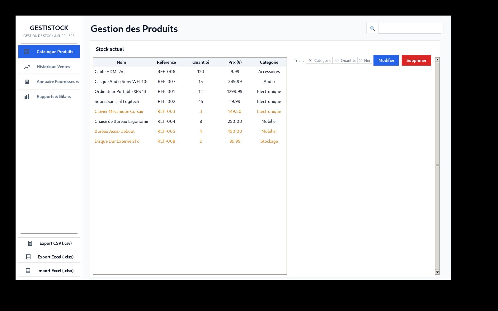

# GestiStock — Logiciel de Gestion de Stocks Logistiques

GestiStock est une application web conçue pour l'administration et le suivi d'inventaires logistiques. Développée en PHP 8 avec une architecture MVC stricte "from scratch", elle garantit des performances optimales sans s'appuyer sur des frameworks lourds.

## 📸 Aperçu de l'interface

Voici quelques exemples de l'interface de l'application :

| Vue d'ensemble du Dashboard | Interface d'Entrées/Sorties |
| :---: | :---: |
|  |  |

## 🚀 Fonctionnalités principales

- **Tableau de bord logistique** : Statistiques, alertes de rupture de stock et vue globale de l'entrepôt.
- **Gestion des Mouvements (E/S)** : Enregistrement et traçabilité des entrées et sorties de marchandises.
- **Architecture MVC (Modèle-Vue-Contrôleur)** : Structure backend "maison" séparant rigoureusement la logique métier, l'accès aux données et l'affichage.
- **Sécurité et Performance** : Pattern Singleton pour la connexion base de données et sécurisation des requêtes via PDO (requêtes préparées).

## 🛠️ Stack & Technologies

- **Backend** : PHP 8 OOP (Orienté Objet)
- **Base de données** : MySQL avec PDO
- **Frontend** : HTML, CSS, JavaScript Vanilla
- **Architecture** : MVC Custom, Design Pattern Singleton

---
*Développé par Misbaou DIALLO.*
